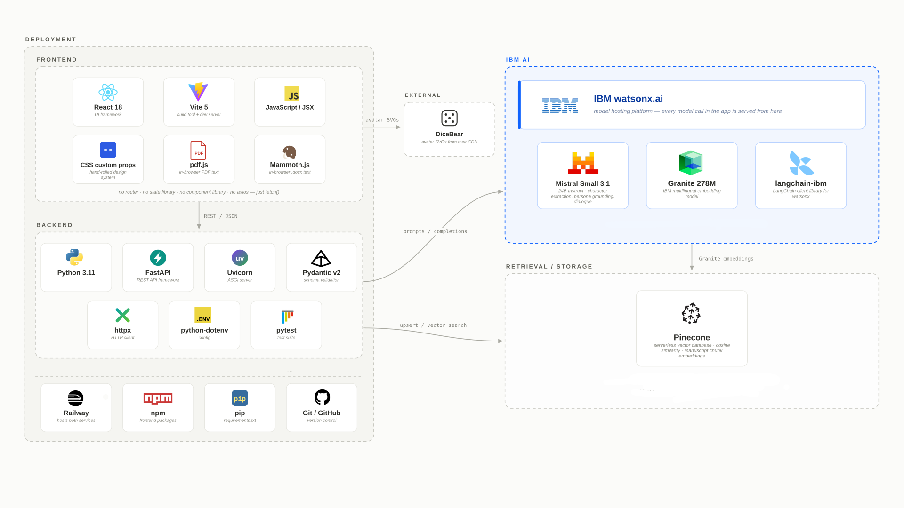

# The Green Room - IBM Bob July Challenge

_A green room is where actors go backstage in a theatre where actors rest and interact before acting. Allow your characters to do so, and learn from them._

Challenge theme: Reimagine Creative Industries with AI

## Motivation

The Green Room is a platform to help writers combat writer's block. Upload a
manuscript and this one fills with its characters — talk to them one at a
time, or put several on stage together and watch what they do to each other.
Built for the IBM Bob AI Builders Challenge (July theme: *Reimagine Creative
Industries with AI*).

## How to Use

1. **Upload a manuscript** — supports `.docx`, `.pdf`, and plain text.
2. **Personas are generated** for every character who appears, grounded in the text.
3. **Set the timeline** — choose how far into the manuscript the writer wants characters to "know" for this session.
4. **Chat** — ask anything, and the character will answer with personality and emotional tone coming through.
5. **Or stage a scene** — give a prompt, and watch multiple characters converse. The tool surfaces their outcomes, feelings, a fleshed-out sense of the scenario, and the final exchange.

## Demo

Demo video: (add video later)

<table>
  <tr>
    <td></td>
    <td></td>
  </tr>
  <tr>
    <td></td>
    <td></td>
  </tr>
</table>

## Tech Stack

## AI Approach and Architecture

### Retrieval-augmented generation — IBM Granite embeddings + Pinecone

The manuscript is chunked in order, embedded with IBM's Granite embedding model on watsonx.ai, and indexed in a Pinecone serverless vector database. Every generation — persona grounding, chat replies, scene dialogue — is answered from passages retrieved from that index rather than the model's own memory of the book. Retrieval is capped to the writer's chosen timeline position, which is what keeps characters from knowing their own endings.

### Character extraction and persona building — IBM watsonx.ai

Personas are built by a four-stage pipeline:

1. **Discovery** — reads the manuscript and lists everyone who appears.
2. **Consolidation** — merges aliases and nicknames (e.g. "Elizabeth", "Lizzy", "Miss Bennet") into one canonical character.
3. **Ranking** — a deterministic scan ranks characters by how often they actually appear and drops background names.
4. **Grounding** — writes the persona card (traits, motivations, voice, physical description, relationships) from retrieved passages only — never from the name alone.

### 2D character generation — DiceBear

Each persona card includes a `physical` field extracted from the manuscript. An LLM call maps that freeform description onto a fixed menu of avatar parameters — hairstyle, hair color, skin tone, facial hair, accessories, clothing — which are passed to **DiceBear** (Avataaars style) to render a deterministic SVG avatar for the character. After every line a character speaks, an expression tag is parsed off that completion and mapped onto the avatar, so the character's visible emotional state updates as a conversation or scene unfolds. 

## How IBM Bob was used

This project was built with **IBM Bob** as our AI coding assistant throughout — used for writing new code, debugging errors, scaffolding boilerplate, and reviewing changes across both the backend and frontend. It sat alongside the actual watsonx.ai/Granite stack that powers the product itself, functioning as our day-to-day development environment.

